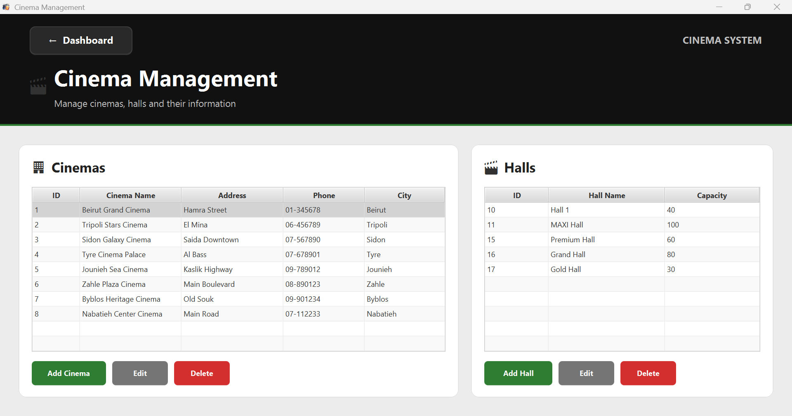

# 🎬 Lebanon Cinema Booking System

A desktop-based **Cinema Management and Booking System** developed using **Java, JavaFX, and MySQL**.

The system is designed to manage cinema branches across Lebanon, including movies, shows, halls, seats, customers, bookings, payments, snacks, employees, reports, and AI-powered movie recommendations.

---

## ✨ Features

### 🔐 Authentication & Access Control
- Employee login system
- Role-based access
- Environment-based configuration

### 🎬 Movie Management
- Add, edit, and delete movies
- Movie search and filtering
- Genre, language, duration, and age rating
- TMDB integration for movie information and posters

### 🏢 Cinema Management
- Manage cinema branches
- Manage cinema halls and capacity
- Manage cities and cinema information

### 🕒 Show Management
- Schedule movie shows
- Assign movies to halls
- Manage show dates and times

### 🎟️ Booking & Seat Management
- Customer and show selection
- Interactive seat selection
- Standard and VIP seats
- Real-time seat availability
- Booking summary and invoice
- Snack selection
- Booking confirmation
- Print and email booking options

### 🤖 AI Movie Recommendations
- AI-powered movie recommendations
- Recommendations based on user preferences
- Genre, language, age rating, and duration matching
- Movie details and descriptions

### 🍿 Snack Management
- Manage cinema snacks
- Add snacks to bookings
- Quantity management
- Automatic price calculation

### 📊 Reports & Analytics
- Cinema performance reports
- Revenue statistics
- Tickets sold
- Number of shows
- Occupancy rate
- Weekly revenue comparison
- Movie viewing distribution
- Daily revenue trends
- Cinema branch comparison
- Report export

### 📧 Email Integration
- Email booking information
- Booking notifications using JavaMail

---

## 🖥️ Screenshots

### 🔐 Login
<p align="center">
  
</p>

### 🏠 Dashboard
<p align="center">
  
</p>

### 🎬 Movie Management
<p align="center">
  
</p>

### 🤖 AI Movie Recommendations
<p align="center">
  
</p>

### 🎟️ Booking & Seat Selection
<p align="center">
  
</p>

### 🏢 Cinema & Hall Management
<p align="center">
  
</p>

### 📊 Reports & Analytics
<p align="center">
  
</p>

---

## 🛠️ Technologies

| Technology | Purpose |
|---|---|
| **Java** | Core application development |
| **JavaFX** | Desktop graphical user interface |
| **MySQL** | Database management |
| **JDBC** | Database connectivity |
| **NetBeans** | Development environment |
| **TMDB API** | Movie information and posters |
| **JavaMail** | Email integration |

---

## 📁 Project Structure

```text
CinemaSystem/
│
├── src/
│   └── cinemasystem/
│       ├── controller/       # Application controllers
│       ├── database/         # Database connection
│       ├── model/            # Application models
│       ├── util/             # Utility and service classes
│       └── ...
│
├── lib/                      # Required third-party libraries
├── nbproject/                # NetBeans project configuration
├── screenshots/              # Project screenshots
├── .env.example              # Environment variable template
├── .gitignore
├── build.xml
├── manifest.mf
└── README.md

---

## ⚙️ Requirements

Before running the project, make sure you have:

- **JDK 17 or later**
- **JavaFX SDK**
- **MySQL Server**
- **NetBeans IDE** or another compatible Java IDE
- Required third-party libraries included in the `lib` folder

---

## 🚀 Getting Started

### 1. Clone the Repository

```bash
git clone https://github.com/hibanasrallah06/Lebanon-Cinema-Booking-System.git
cd Lebanon-Cinema-Booking-System


## 🔒 Security

Sensitive credentials are not included in the repository.

The application uses environment variables for:

- Database credentials
- Email credentials
- TMDB API token

Use `.env.example` as a template and never commit your actual `.env` file.

---

## 🤖 AI Movie Recommendations

The system includes an AI-powered recommendation feature that suggests movies based on user preferences such as:

- Genre
- Language
- Age rating
- Duration

Movies are matched and ranked according to preference compatibility, then displayed with their main information and descriptions.

---

## 📊 Reports & Analytics

The reporting module provides:

- Revenue statistics
- Tickets sold
- Number of shows
- Occupancy rate
- Weekly revenue comparison
- Movie viewing distribution
- Daily revenue trends
- Cinema branch comparison
- Report export

---

## 🔮 Future Improvements

- Online customer booking
- Mobile application
- Online payment integration
- Advanced machine-learning recommendations
- Customer accounts and booking history
- Cloud database integration
- Real-time synchronization between cinema branches

---

## 👩‍💻 Author

**Hiba Nasrallah**

Computer Science Student at Islamic University Of Lebanon (IUL) - Tyre Campus

---

## 📌 Project Status

**Completed – University Training Project**

A desktop-based cinema management and booking system with JavaFX, MySQL, TMDB integration, email functionality, reporting, and AI-powered movie recommendations.